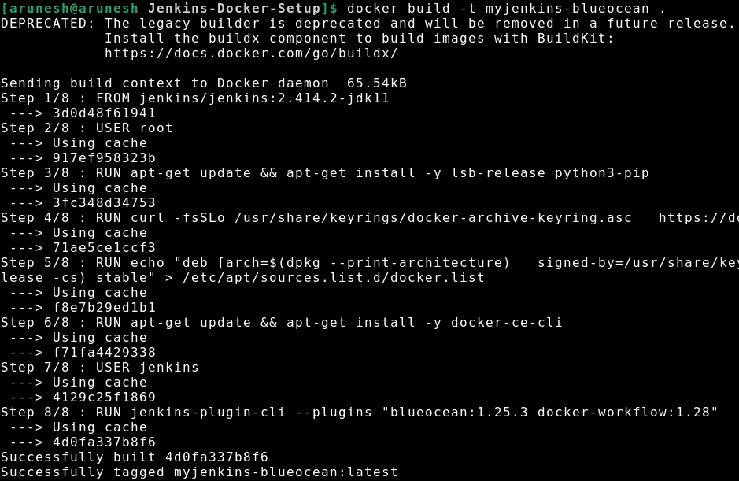
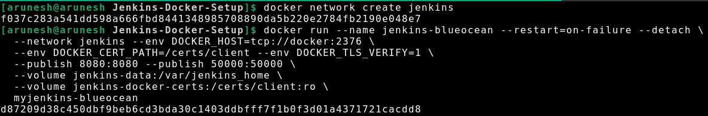
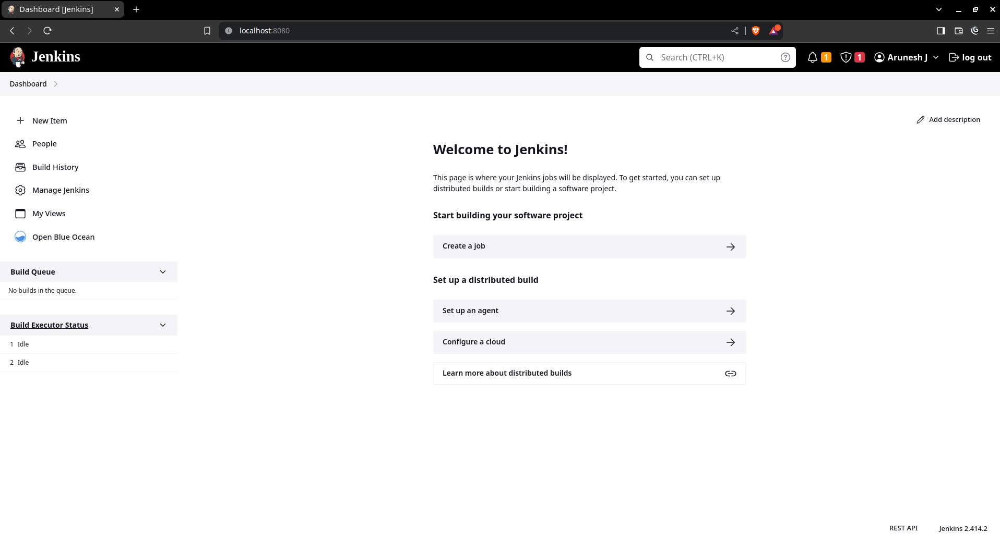
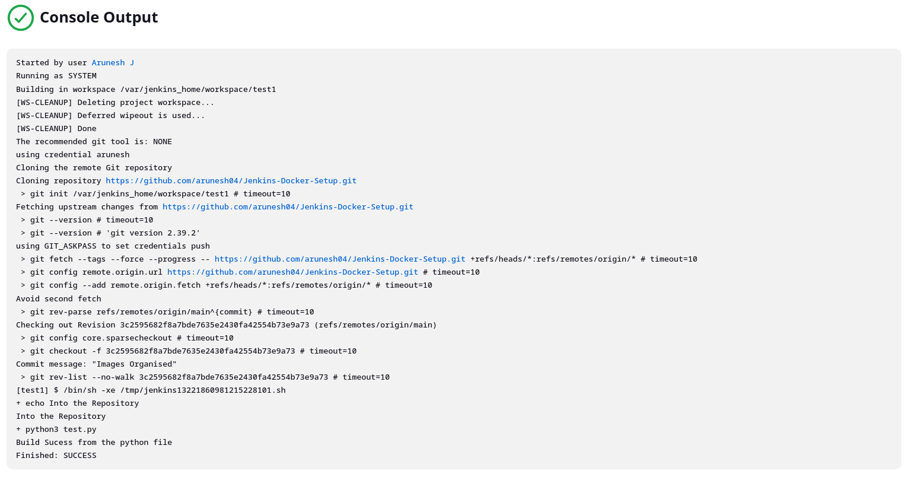
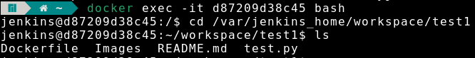

# Overview
This repository contains the setup for installing Jenkins with Docker using the Blue Ocean plugin and build a simple python code with both the Freestyle project and Pipeline with stages.

## Jenkins Installation
### Prerequisites
- Docker installed on your system.
- Basic knowledge of Docker commands.

### Installation
1. Clone this repository:
   ```bash
   git clone https://github.com/arunesh04/Jenkins-Docker-Setup.git
   ```

2. Navigate to the cloned directory:
   ```bash
   cd Jenkins-Docker-Setup
   ```

3. Build the Docker image:
   ```bash
   docker build -t myjenkins-blueocean .
   ```
    
4. Create a Docker network named 'jenkins':
   ```bash
   docker network create jenkins
   ```

5. Run Jenkins container:
   ```bash
   docker run --name jenkins-blueocean --restart=on-failure --detach \
     --network jenkins --env DOCKER_HOST=tcp://docker:2376 \
     --env DOCKER_CERT_PATH=/certs/client --env DOCKER_TLS_VERIFY=1 \
     --publish 8080:8080 --publish 50000:50000 \
     --volume jenkins-data:/var/jenkins_home \
     --volume jenkins-docker-certs:/certs/client:ro \
     myjenkins-blueocean
   ```
    

6. Access Jenkins in your browser at [http://localhost:8080](http://localhost:8080).

    

### Usage
- Open your browser and navigate to [http://localhost:8080](http://localhost:8080).
- Follow the setup wizard to complete the installation.
- Use Jenkins for continuous integration and continuous delivery tasks.

### Notes
- Make sure Docker is running and accessible on your system.
- Adjust Docker volume mappings according to your requirements.
- Change `localhost` to your server's IP or domain if accessing remotely.

## Jenkins Freestyle Build 

This part guides you through setting up a Jenkins Freestyle build job that includes running shell commands and checking files in the repository.

### Prerequisites
- Jenkins installed and running. If not, follow the instructions in the [Jenkins Installation](#jenkins-installation) section.
- Python3 installed on your Jenkins server.

### Procedure

1. Access Jenkins by navigating to [http://localhost:8080](http://localhost:8080) in your browser.

2. Click on **New Item** on the Jenkins dashboard.

3. Enter a name for your project, select **Freestyle project**, and click **OK**.

4. In the project configuration page:
   - Under **General**, provide a brief description of your project.
   - In the **Source Code Management** section, select **Git** and provide your GitHub repository URL.
   - Leave other settings as default or adjust them according to your requirements.

5. In the **Build** section, add the following shell commands:
   ```bash
   echo "Into the Repository"
   python3 test.py
   ```

6. Click on **Save** to save your project configuration.

### Running the Build

1. On the Jenkins dashboard, click on your project.

2. Click on **Build Now** to trigger a build.

3. Wait for the build to complete. You can monitor the progress in the Jenkins console.

4. Once the build is finished, check the console output for any errors or warnings.

   

5. To check the file in the repository, you can log in to the Jenkins server and execute the following command:
   ```bash
   docker exec -it myjenkins-blueocean bash
   ```
   

### Additional Notes
- Ensure that your Jenkins server has necessary permissions to access your GitHub repository.
- Adjust shell commands according to your project requirements.
- Make sure Docker container name (`myjenkins-blueocean`) matches your Jenkins container name.
- You may need to install additional packages or configure environment variables based on your specific needs.

### License
This project is licensed under the MIT License - see the [LICENSE](LICENSE) file for details.
