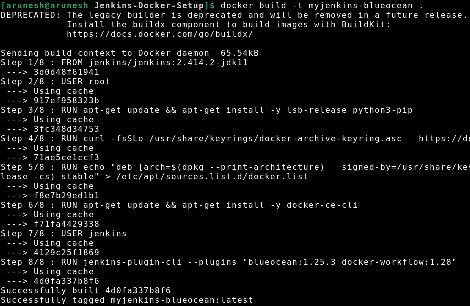
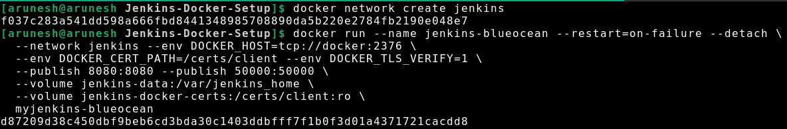

# Overview
This repository contains the setup for installing Jenkins with Docker using the Blue Ocean plugin and build a simple python code with both the Freestyle project and Pipeline with stages.

## Jenkins Installation
### Prerequisites
- Docker installed on your system.
- Basic knowledge of Docker commands.

### Installation
1. Clone this repository:
   ```bash
   git clone https://github.com/arunesh04/Jenkins-Docker-Setup.git
   ```

2. Navigate to the cloned directory:
   ```bash
   cd Jenkins-Docker-Setup
   ```

3. Build the Docker image:
   ```bash
   docker build -t myjenkins-blueocean .
   ```
    
4. Create a Docker network named 'jenkins':
   ```bash
   docker network create jenkins
   ```

5. Run Jenkins container:
   ```bash
   docker run --name jenkins-blueocean --restart=on-failure --detach \
     --network jenkins --env DOCKER_HOST=tcp://docker:2376 \
     --env DOCKER_CERT_PATH=/certs/client --env DOCKER_TLS_VERIFY=1 \
     --publish 8080:8080 --publish 50000:50000 \
     --volume jenkins-data:/var/jenkins_home \
     --volume jenkins-docker-certs:/certs/client:ro \
     myjenkins-blueocean
   ```
    

6. Access Jenkins in your browser at [http://localhost:8080](http://localhost:8080).

    

### Usage
- Open your browser and navigate to [http://localhost:8080](http://localhost:8080).
- Follow the setup wizard to complete the installation.
- Use Jenkins for continuous integration and continuous delivery tasks.

### Notes
- Make sure Docker is running and accessible on your system.
- Adjust Docker volume mappings according to your requirements.
- Change `localhost` to your server's IP or domain if accessing remotely.

### License
This project is licensed under the MIT License - see the [LICENSE](LICENSE) file for details.
